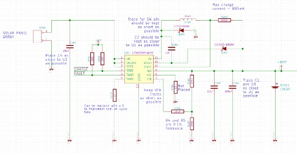

# Instrumentation Buoy Logic Board - Technical Documentation

# Revision History

|    Date          	|    Revision    	|    Description    	|    Author       	|
|------------------	|----------------	|-------------------	|-----------------	|
|    6 May 2020    	|    A           	|    First issue    	|    Andrew Li    	|

# Introduction

The document outlines the design considerations that were taken in the design of the instrumentation buoy logic board.

## Design requirements

# Power supply

The power supply is required to source the currents

## Power budget

## Solar charging

Solar charging is provided by the LT3652 charge controller from Linear Technology. The LT3652 is a step-down battery charger that operates over a 4.95V to 32V input voltage range (40V absolute maximum).

### Maximum charge current

The lithium ion cell used can charge at 1C (2.6A, 9.62W). Given that the maximum power provided the solar cell array is approximately 1W, the designed maximum charging current is calculated as below:

R208 is the RSENSE resistor. It's value is calculated as follows:

Formulae

)%7D%26%3D%20%5Cfrac%7B1000%7D%7B2.8V%7D%5C%5C%20%5Cend%7Balign*%7D) (mA)

Selecting from E24 series resistor values, a 1% tolerance 270mOhm resistor is used for R208. The actual , however for simplicity, 357mA will be used for remaining calculations.

|
 | Requirement |
 |
| --- | --- | --- |
| Resistance | 270mOhms | 270 |
| Tolerance | 1% | 1% |
| Minimum current rating specification | 370mA + 50% margin = 555mA |
 |

    1.
### Input voltage supply decoupling capacitor

This is implemented using C201.

The manufacturer recommends using a high quality, low ESR decoupling capacitor at the input pin of LT3652. The decoupling capacitor is used to sink input ripple current. The input charging RMS ripple current is given by Equation [].

The above relation is maximum when . We designed . Therefore:

Therefore, the maximum input charging RMS input current is 0.18A.

The minimum bulk capacitance required at the input is given by the below equation, where . This is the maximum acceptable as specified by the manufacturer.

The voltage rating of C201 needs to have voltage rating greater than 9V (three solar cells in series) as well as maintain sufficient capacitance at the operating voltage such that the input ripple voltage is maintained below 100mV.

The manufacturer recommends a value of 10uF for C201. The below solution has been chosen.

| Solution MPN | Requirement | AVX, TPSD106K035R0125 |
| --- | --- | --- |
| Capacitance | 10uF | 10uF |
| Tolerance | 10% | 10% |
| ESR | Low | 0.12mOhms |
| Voltage rating | 9V + 50% margin = 13.5V | 35V |
| Rated ripple current | 0.18A + 50% margin = 0.27A | 0.986A [at 85degC, 35V] |

This solution will achieve an input charging RMS ripple voltage of:

    1.
### Boost supply

The internal switch driver uses a bootstrapped power supply to drive the internal switch transistor. For correct start-up, the BOOST pin must be above 2V with respect to the SW pin (or VIN pin must be above 3.3V with respect to the SW pin). For correct operation, the VBOOST cannot exceed 8.5V with respect to the SW pin. C202 acts as the bootstrap capacitor. The value of 1uF is recommended by the manufacturer. The voltage rating of C202 must exceed the maximum BAT voltage of 4.2V.

A bootstrap diode D202 connected between the BAT pin and the BOOST pin is required to facilitate the bootstrapping mechanism. The manufacturer recommends using a diode with average current greater than 0.1A and a reverse voltage greater than of 9V.

| Solution MPN | Requirement | Bourns, CD0603-B0240 |
| --- | --- | --- |
| Forward voltage | Low | 0.55V (at IF= 0.2A) |
| Reverse voltage | 9V + 50% margin = 13.5V | 40V |
| Average forward current | 100mA + 50% margin = 150mA | 200mA |
| Reverse leakage current | Low | 10uA (at VR = 30V) |

There is the option of using a Zener diode to clamp the voltage between BOOST and SW pins to be below 8.5V. However, this is not required as only one Li-ion cell is used where the BAT pin voltage will not exceed 4.2V.

    1.
### MPPT temperature compensation

Temperature compensated MPPT (maximum power point tracking) can be implement using an LM234 3-terminal temperature sensor (U203) and resistor network R209, R210 and R203. The values for the resistors are calculated using the equations below.

Where is the temperature coefficient (in V/degC) of the solar panel array. is the maximum power voltage at 25degC.

For our 12 solar cell array, the specifications are:

1% tolerance resistors were used for the resistor in this network. Selecting from E96 component values:

| Resistor | Calculated value | Implemented value |
| --- | --- | --- |
| R203 | 1kOhms | 1kOhms 1% |
| R209 | 344kOhms | 340kOhms 1% |
| R210 | 31.5kOhms | 31.6kOhms 1% |

    1.
### Output capacitor

Output decoupling capacitor C203 is required. The manufacturer&#39;s recommended value is 10uF. The same capacitor used for C201 has been used for C203 to save on BOM count.

    1.
### Inductor design

The primary criterion for inductor value selection in an LT3652 charger is the ripple current created in that inductor. Once the inductance value is determined, an inductor must also have a saturation current equal to or exceeding the maximum peak current in the inductor. An inductor value (L), given the desired amount of ripple current () can be approximated using the relation:

Where is the normalised inductor ripple current. The manufacturer recommends setting to between 25% and 35% of . We will set to 30%. Therefore:

The inductor also needs to meet the minimum volt-second requirement as specified in the equation below:

Inductor maximum RMS and saturation current rations ( and respectively) are calculated as follows:

| | Requirement | Murata, 46223C | TDK, SLF6025T-220MR73-PF |
| --- | --- | --- | --- |
| Inductance at 1MHz operating frequency | 22uH | 22uH | 22uH |
| Tolerance | 20% | 20% | 20% |
| DC resistance | Low | 120mOhms | 122mOhms (typ)146.4mOhms (max) |
| Rated DC saturation current specification | 0.41A + 50% margin = 0.62A | 1.8A (defined when inductance falls below 75% or when component temperature reaches 40degC from TA=25degC). | 0.73A |

    1.
### Rectifier design

The rectifier diode from SW to GND, in a LT3652 battery charger provides a current path for the inductor current when the main power switch is disabled. The rectifier is selected based upon forward voltage, reverse voltage, and maximum current. A Schottky diode is required, as low forward voltage yields the lowest power loss and highest efficiency. The rectifier diode must be rated to withstand reverse voltages greater than the maximum VIN voltage. The minimum average diode current rating is calculated with maximum output current , maximum operational VIN, and output at the precondition threshold (, or ):

| Solution MPN | Requirement | ST Microelectronics, STPS2H100A |
| --- | --- | --- |
| Forward voltage | Low | 0.6V typ. (at IF = 2A) |
| Reverse voltage specification | 9V + 50% margin = 13.5V | 100V (peak repetitive) |
| Average forward current | 0.24A + 50% margin = 0.36A | 2A |
| Reverse leakage current | Low | 1uA (at 25degC) |

    1.
### Battery float voltage programming

The float voltage of the battery is programmed using the resistor network R205, R206 and R207. can be programmed up to 14.4V. Because the battery voltage is across the programming resistor divider, this divider will draw a small amount of current from the battery at a rate of

Values for R205, R206 and R207 are calculated as follows

Setting yields:

The equivalent input resistance at the VFB pin needs to be 250kOhm to compensate for input bias current error. Therefore:

| Resistor | Calculated value | Implemented value |
| --- | --- | --- |
| R205 | 160k | 160kOhms 1% |
| R206 | 90kOhms | 90.9kOhms 1% |
| R207 | 330kOhms | 330kOhms 1% |

    1.
### Thermal design

    1.
### Layout considerations
  1.
## 3V3 power supply

Power supply requirements

|
 | Requirement | Solution |
| --- | --- | --- |
| Minimum output current requirement | 0.794A | 1.6A (min, VIN = 3.6V, TA = 25degC) |
| Output voltage | 3.3V +/- 10% |
 |
| Output voltage ripple | +/-300mV |
 |
| Input voltage range | 2.8V to 4.2V | 1.8V to 5.5V |
| Efficiency | \&gt; 80% at 0.794A |
 |

The TPS63001 voltage regulator (U202) is to switch mode buck-boost converter to efficiently convert the output voltage of the battery to 3V3.

    1.
### Input capacitors

TPS63001 requires at least 4.7uF of input capacitance to improve transient behaviour of the regulator and EMI behaviour of the total power supply circuit. The input capacitor for this design is required to have a voltage rating greater than 4.2V. The reference design provided by the manufacturer uses a GRM188R60J106KME84D, 10uF capacitor from Murata. This is used in the instrumentation buoy logic board.

    1.
### Output capacitors

TPS63001 requires at least 15uF of output capacitance. The reference design for TPS63001 has two 10uF capacitors at its output. The capacitor is required to have a voltage rating greater than 3.3V. The manufacturer recommends the GRM188R60J106KME84D from Murata for both output capacitors. This is used in the instrumentation buoy logic board.

    1.
### Inductor design

L202 is the inductor for the buck-boost mechanism. The peak inductor current is calculated using the equations below:

Where:

|
 | Minimum input voltage | 2.8V |
| --- | --- | --- |
|
 | Output voltage | 3.3V |
|
 | Efficiency of the converter at worst case loading | 80% |
|
 | Converter operating frequency | 1.25MHz to 1.8MHz |
|
 | Inductance of inductor at operating frequency | 2.2uH |

The datasheet recommends using a 2.2uH inductor. The solution is listed below.

| Solution MPN | Requirement | TDK, VLS3015CX-2R2M-1 |
| --- | --- | --- |
| Inductance at 2.4MHz operating frequency | 2.2uH | 2.2uH |
| Tolerance | 20% | 20% |
| DC resistance | Low | 64 mOhms (max) |
| Rated DC saturation current specification | 0.85 + 50% margin = 1.28A | 1.71A (30% drop in inductance) |

    1.
### Thermal design

The resistive heating dissipated during operation at is calculated below:

Calculating the between the IC junction and ambient at peak power.

At maximum ambient temperature of 30degC, the junction temperature will be 33.1degC. This is well below the maximum operating junction temperature of 125degC, therefore no heat sinking is required.

  1.
## Layout considerations

The manufacturer recommends the below layout.

1.
# Microcontroller

  1.
## RTC

The RTC is used to keep track of the time so that the data can be timestamped. Allowable drift of the RTC is 20mins per year.

The 32.768kHz crystal used was the CC4V-T1A 32.768KHZ +-20PPM 9PF. The specifications for the crystal are listed below:

| Load capacitance | 9.0pF |
| --- | --- |
| Frequency tolerance | 30ppm |
| Drive power | 1.0uW |
| Aging first year max. | 3ppm |
| Frequency vs temperature | -0.035ppm/degC |

A properly designed oscillator with this crystal will exhibit a theoretical maximum frequency drift of 30 + 3 + 0.7 = 33.7ppm after one year of operation. This equates to 18 mins per year.

Calculations of C309 and C310, the external capacitors for the crystal are as follows, assuming the stray capacitance between the crystal pins is 3pF.

  1.
## HC-12

The HC-12 is the wireless module that allows UART communication to occur wirelessly. The effective range is 1km, given an adequate antenna.

  1.
## Battery voltage measurement

The battery voltage is measured using a resistor divider R301 and R302. The values were chosen such that the voltage at +BAT\_AD is 3V when the +BATT net is 4.2V. Schottky diode D301 with is used to clamp voltage at +BATT\_AD to less than 3.5V to protect the MCU pin. The ADC reading this voltage is 10 bits. This gives a resolution of 3.2mV.

| +BATT voltage | +BATT\_AD voltage | ADC count (10 bits, 0 to 1023) |
| --- | --- | --- |
| 2.8V | 1.90V | 589 |
| 4.2V | 2.86V | 887 |

  1.
## SD card
  2.
## Indication LEDs
1.
# Sensing

  1.
## Accelerometer

The accelerometer used is the ADXL343. It is set to operate at the +/-2g range, 100Hz output data rate. The accelerometer requires a 1uF decoupling capacitor at the VS pin (C401) and a 100nF decoupling capacitor at the VDDIO pin (C402).

  1.
## Pressure sensor

The pressure sensor ABPMANN005PG2D3 used is a digital pressure sensor with I2C interface. It is rated to 5 PSI, gauge pressure, DIP package with single axial barbed port.

The formula for translating counts to pressure is given below.

Where:

Pressure calculations for the inside of the buoy can be found in Section [].

  1.
## Depth measurement

The depth measurement apparatus is used to measure the depth that the buoy is submerged in the water as it floats in the ocean. It does this using an using two 800mm metal rods made from nichrome with a resistivity of 13.77Ohms/m, strapped on the side of the buoy. A schematic of the apparatus is shown in Figure [], where is the water depth as measured from the top of the buoy. The resistance measured between points and is given by the expression below. The resistivity of seawater .

is driven by a constant current source built around D401, R402, R404 and Q402. The design of the current source is outlined below.

    1.
### Zener diode design

The current source will be designed to source 30mA of current. 30mA is a good trade-off between signal to noise ratio and power consumption.

A 1.8V Zener diode was selected as the voltage reference. To maintain a 1.8V Zener voltage, the Zener voltage needs to be around 600uA. This current is programmed using R402.

The implemented value for R402 is 2.4kOhms, selected from E24 values.

The transistor Q402, when switched on exhibits a of 0.70V. There the emitter current and base current of Q402 is

The current of the current source equals the collector current of Q402. Therefore, the current source current is calculate as follows:

_Figure 1_

    1.
### Instrumentation amplifier

We would like to resolve the depth to within 5mm over 800mm (0.6%). We calculate the minimum and maximum values of .

The voltage across is as follows

To amplifier the signals such that is amplified to 3.0V, the gain of the instrumentation amplifier needs to be around 4.52. The gain of the instrumentation amplifier can be calculated as below.

Where

The output voltage to the ADC is as follows

The ADC count (10 bit ADC) is calculated as follows

Where is the water depth as measured from the top of the buoy.

The signal is passed through a low pass filter implemented with R409 and C403 with a cut-off frequency of 1kHz to attenuate noise before being fed into the ADC of the microcontroller.

1.
# LED drive

  1.
## Light detect

A photoresistor (connected to P502) in conjunction with a resistor R510 is used to detect night and day and automatically used to switch on the LED lights. The VT90N1 has a resistance between 6kOhms and 18kOhms at 10 lux and 200k at 0 lux. The signal is fed through a low pass filter before being fed into the ADC pin. The specifications for the light detect circuit is shown below.

|
 | 10 lux | 0 lux |
| --- | --- | --- |
| Min voltage / ADC count at LIGHT\_DETECT\_AD | 2.50V / 755 | 0.72V / 223 |
| Max voltage / ADC count at LIGHT\_DETECT\_AD | 2.99V / 927 | 0.72V / 223 |

  1.
## LED

The buoy uses six Cree Inc. CLA2A-WKW-CYBZ0343 white LED modules (LED501 to LED506). Each LED module contains two LEDs. The LEDs have the following specifications:

| Colour temperature | 5500K typ. |
| --- | --- |
| Luminous intensity (at IF = 2 x 20mA) | 3550 to 5600 mcd |
| Forward current | 2 x 25mA |
| Peak forward current | 2 x 100mA (pulse width =\&lt; 0.1s, duty =\&lt; 0.1) |
| Forward voltage (at IF = 20mA) | 3.2V typ., 4.0V max |
| Viewing angle | 60 degrees (when relative luminous intensity drops by 50%) |

The LEDs have been designed to operate at 20mA per diode which achieves a relative luminous intensity of 1. The buoy will shine with a luminous intensity between 21.3cd and 33.6cd per flash.

  1.
## LED driver

The FAN5333A from ON Semiconductor (U501) was selected to drive the LED array. The specifications for FAN5333A are shown below:

|
 | Requirement | Specification |
| --- | --- | --- |
| Input voltage range | 2.8V to 4.2V | 1.8V to 5.5V |
| Output voltage | Greater than 19.5V | From VIN to 30V |
| Output load current | Greater than 40mA | 65mA min. |

    1.
### Maximum output voltage

The output voltage is calculated to ensure that the voltage is within the capabilities of the FAN5333A chip.

The calculated output voltage is within the maximum output voltage capability of the FAN5333A.

    1.
### Setting output current

The output current is programmed by selecting the feedback resistor R512. For the FAN5333A, .

Examining the current and voltage curves of the FAN5333A, the required output current of 40mA can only be maintained if the battery voltage is above 3.0V. This is sufficient as the battery voltage will likely be high at the start of evening due to an entire day of charging under the sun. If the 40mA output current cannot be sourced, the LEDs will still be able to shine with sufficient brightness.

    1.
### Inductor design

The manufacturer recommends using a 10uH inductor with saturation current greater than 1A and a DC resistance as low as possible to improve converter efficiency. The SLF6025T-100M1R0-PF from TDK was selected, which is also a part recommended by the manufacturer.

|
 | Requirement | TDK, SLF6025T-100M1R0-PF |
| --- | --- | --- |
| Inductance | 10uH | 10uH |
| DC resistance | Low | 68.76mOhms (max) |
| Saturation current | Equal or greater than 1A | 1A |

    1.
### Capacitor selection

The manufacturer recommends input and output capacitors of values 10uF and 1uF respectively. These are implemented by capacitors C505 and C501 respectively, X5R SMD ceramic capacitors.

1.
# Mechanical Design
