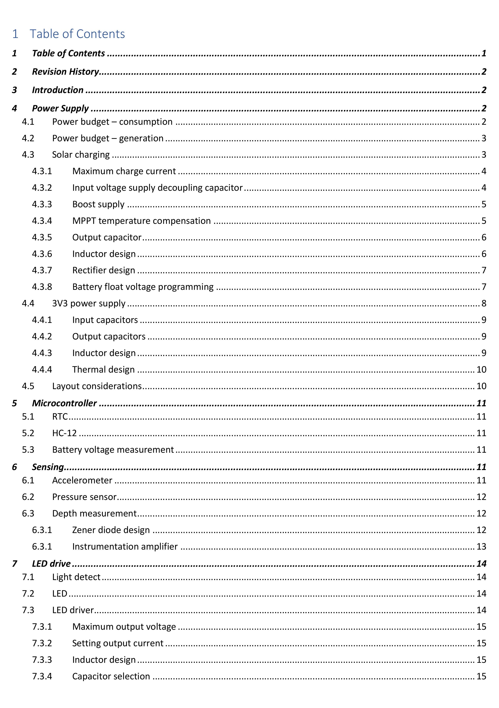
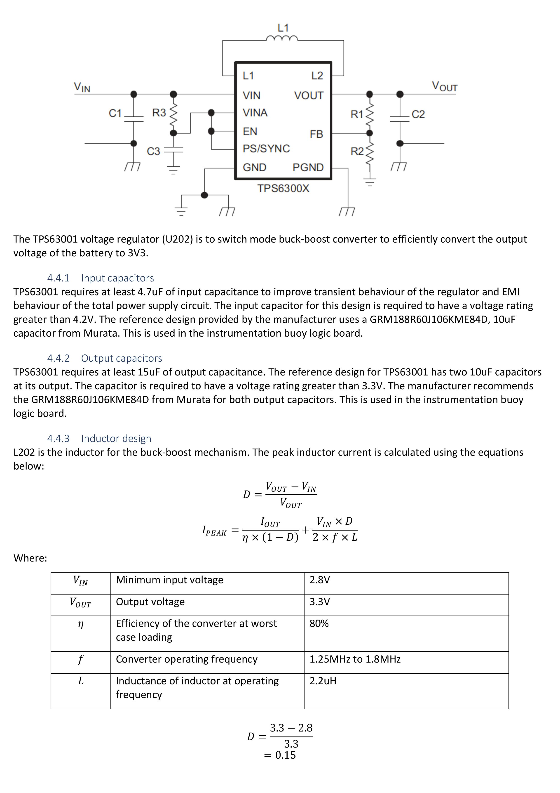
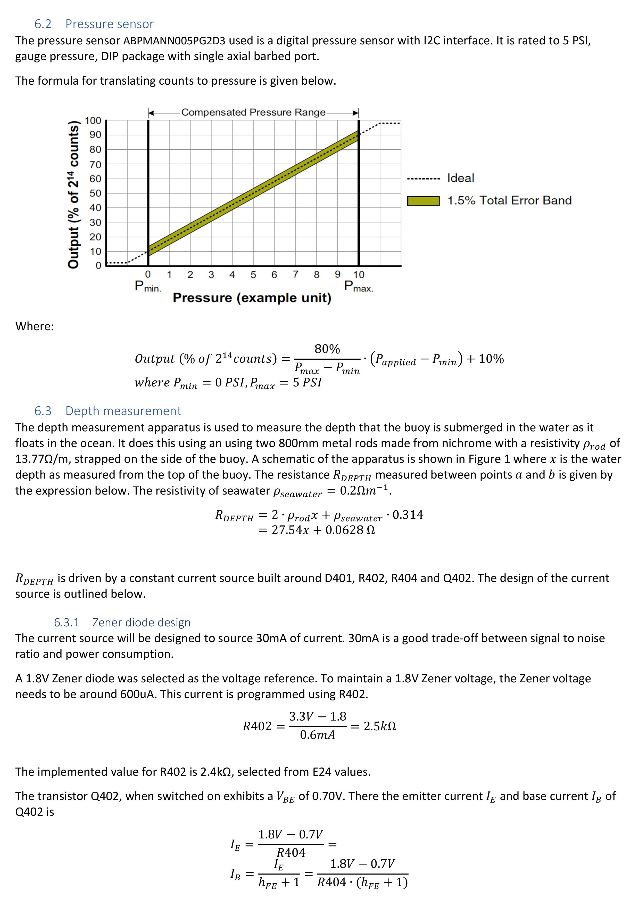
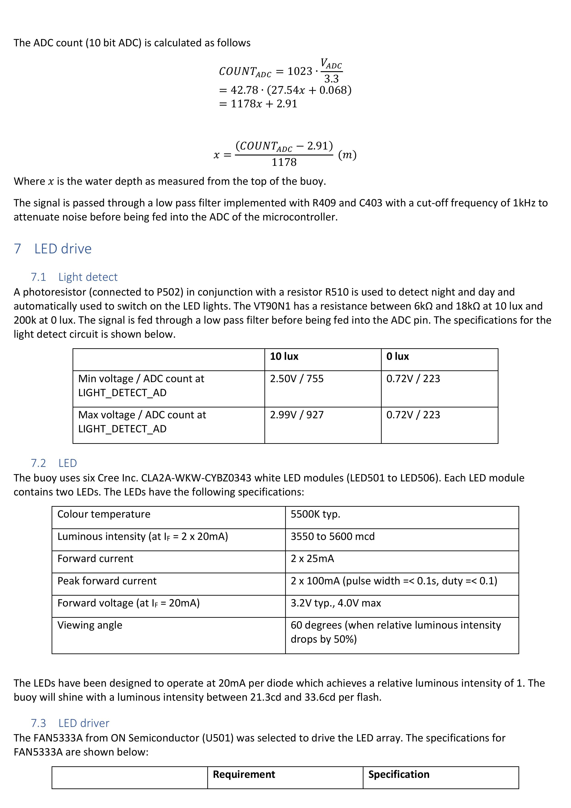
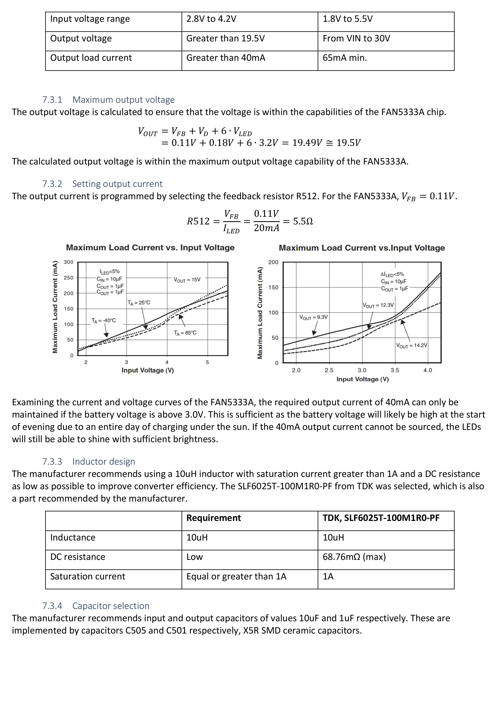

# Instrumentation Buoy Data Logger - Version 2

A continuation from the Instrumentation Buoy Data Logger (Version 1) project, Version 2 features a new PCB layout where the electronics of the Main Board and Power Board are combined into one PCB assembly to make it easier to assemble the buoy. Improvements were made to the solar charging circuitry, a new wireless module has been used and the LED safety light has been redesigned. Also for the first time, I've published the full technical documentation of this design as a learning and reference resource for other hardware designers.

The imagery shown above is a concept design of the new buoy prototype.

## Technical Documentation

